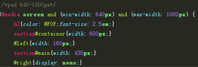
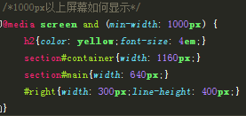

# web-responsive-layout
<h3>According to the media query, a style of the terminal is given.</h3>
<h3>In this model,we provide that the phone's width less than 640px,the pad's width between 640px and 1000px,and the pc's width more than 1000px,your can adjust it to your model.<h3>
<h3> The phone side style code is as follows.</h3>

<h3> The pad side style code is as follows.</h3>

<h3> The pc side style code is as follows.</h3>

